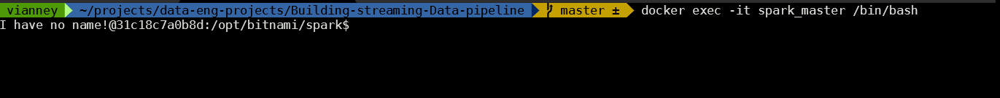

# Building-streaming-ETL-Data-pipeline


Building streaming Data pipeline using apache airflow, kafka ,...


## 1. Project overview and  architecture


In this project, we build a real-time ETL (Extract, Transform, and Load) data pipeline.  During this process we will use open api to get data Building a streaming ETL (Extract, Transform, Load) data pipeline involves ingesting real-time data , process and transform , and load it into a data storage or analytics system. This overview outlines the process of building such a pipeline requiring Apache Kafka for data ingestion, Apache Spark for data processing, and Amazon S3 for data storage. 


 


### Apache kafka 

- ***Set up Kafka Cluster***: Deploy a Kafka cluster with multiple brokers for high availability and scalability.

- ***Create Kafka Topics*** : Define topics to categorize and organize the incoming data streams based on their sources or types.
- ***Configure Kafka Producers*** : integrate Kafka producers to send data from open api to the appropriate Kafka topics.
- 
 

  
### Automation and Orchestration

Leverage automation and orchestration tools (e.g., Apache Airflow) to manage and coordinate the various components of the pipeline, enabling efficient deployment, scheduling, and maintenance.
 


### Data Processing with Apache Spark

Apache Spark is a powerful open-source distributed processing framework that excels at processing large-scale data streams. In this pipeline, Spark will consume data from Kafka topics, perform transformations and computations, and prepare the data for storage in Amazon S3.

- ***Configure Spark Streaming*** : Set up a Spark Streaming application to consume data from Kafka topics in real-time.
- ***Define Transformations*** : Implement the necessary transformations and computations on the incoming data streams using Spark's powerful APIs. This may include data cleaning, filtering, aggregations, and enrichment from other data sources.
- ***Integrate with Amazon S3*** : Configure Spark to write the processed data to Amazon S3 in a suitable format (e.g., Parquet, Avro, or CSV) for efficient storage and querying.

### Data Storage in Minio S3
MinIO is a high-performance, S3 compatible object store. A MinIO "bucket" is equivalent to an S3 bucket, which is a fundamental container used to store objects (files) in object storage. In this pipeline, S3 will serve as the final destination for storing the processed data streams.

- ***Create S3 Bucket*** : Set up an S3 bucket to store the processed data streams.
- ***Define Data Organization***: Determine the appropriate folder structure and naming conventions for organizing the data in the S3 bucket based on factors such as time, source, or data type.

- ***Configure Access and Permissions*** : Set up appropriate access controls and permissions for the S3 bucket to ensure data security and compliance with organizational policies.


 <br />


## 2. Getting Started

**Prerequisites**

 - **Docker and docker compose** 
 - **S3 bucket created**: We will use Mini object storage
 -  Basic understanding of Python and apache spark
 -  Knowledge of how kafka works: topic, brokers and kafka streaming


## 3. Setting up project environment:

a. Make sure docker is running: from terminal ``` docker --version```


b. Clone the repository and navigate to the project directory


```
 git clone https://github.com/fermat01/Building-streaming-ETL-Data-pipeline.git
 ```
and 


```
 cd Building-streaming-ETL-Data-pipeline
 ```
c. Will create dags and logs directories for apache airflow and create a network from terminal
c.. Create two folders dags and logs for apache airflow:

```
mkdir dags/ logs/
```
and give them permission


```
chmod -R 777 dags/
chmod -R 777 logs/
```

d. From terminal create a network
```
docker network create streaming_network
```

** Create all services using docker compose by using**

```
docker compose up -d 

```
1.  Access airflow UI at http://localhost:8080 using given credentials username: *``` airflow01 ```* and password: *``` airflow01 ```*

 


2.  Access the Kafka UI at http://localhost:8888 and  create topic name it   *``` streaming_topic```*
   
 

3.  Create Minio docker container

```  
docker run \
   -p 9090:9000 \
   -p 9001:9001 \
   --name minio \
   -v ~/minio/data:/data \
   -e "MINIO_ROOT_USER=MINIOAIRFLOW01" \
   -e "MINIO_ROOT_PASSWORD=AIRFLOW123" \
   quay.io/minio/minio server /data --console-address ":9001"
```
 and acess minio  UI using ``` http://127.0.0.1:9001 ``` and credentials uername: *``` MINIOAIRFLOW01 ```* and password: *``` AIRFLOW123 ```*


  

## 4. Copy your Spark script into the Docker container:
```
docker cp data_processing_spark.py spark_master:/opt/bitnami/spark/
```
  

*and go inside spark container master node*

```
 docker exec -it spark_master /bin/bash
```
  

*and to list all jar files in jars directory*

```
cd jars
```

and 
```
ls -l
```

 **Download required jar files**
   
   ```
curl -O https://repo1.maven.org/maven2/org/apache/kafka/kafka-clients/2.8.1/kafka-clients-2.8.1.jar
curl -O https://repo1.maven.org/maven2/org/apache/spark/spark-sql-kafka-0-10_2.12/3.3.0/spark-sql-kafka-0-10_2.12-3.3.0.jar
curl -O https://repo1.maven.org/maven2/org/apache/hadoop/hadoop-aws/3.2.0/hadoop-aws-3.2.0.jar
curl -O https://repo1.maven.org/maven2/com/amazonaws/aws-java-sdk-s3/1.11.375/aws-java-sdk-s3-1.11.375.jar
curl -O https://repo1.maven.org/maven2/org/apache/commons/commons-pool2/2.8.0/commons-pool2-2.8.0.jar

   ```

*Go back using*

 ```
 cd ..
  ```
  **Submit your spark application by using**

```
   spark-submit \
      --master local[2] \
      --jars /opt/bitnami/spark/jars/kafka-clients-2.8.1.jar,\
      /opt/bitnami/spark/jars/spark-sql-kafka-0-10_2.12-3.3.0.jar,\
      /opt/bitnami/spark/jars/hadoop-aws-3.2.0.jar,\
      /opt/bitnami/spark/jars/aws-java-sdk-s3-1.11.375.jar,\
      /opt/bitnami/spark/jars/commons-pool2-2.8.0.jar \
      data_processing_spark.py

```


To be continued ...


<!---

spark-submit \\
--master local[2] \\
--jars /opt/bitnami/spark/jars/kafka-clients-2.8.1.jar,\\
/opt/bitnami/spark/jars/spark-sql-kafka-0-10_2.12-3.3.0.jar,\\
/opt/bitnami/spark/jars/hadoop-aws-3.2.0.jar,\\
/opt/bitnami/spark/jars/aws-java-sdk-s3-1.11.375.jar,\\
/opt/bitnami/spark/jars/commons-pool2-2.8.0.jar \\
data_processing_spark.py

spark-submit \
  --master local[*] \
  --jars /opt/bitnami/spark/jars/kafka-clients-2.8.1.jar,/opt/bitnami/spark/jars/spark-sql-kafka-0-10_2.12-3.3.0.jar,/opt/bitnami/spark/jars/hadoop-aws-3.2.0.jar,/opt/bitnami/spark/jars/spark/jars/aws-java-sdk-s3-1.11.375.jar,/opt/bitnami/spark/jars/commons-pool2-2.8.0.jar\
  test.py

--->