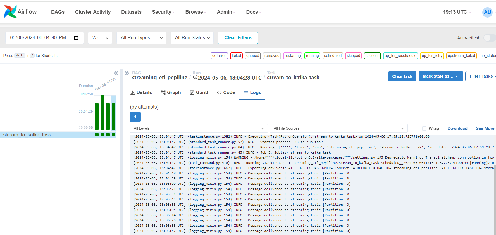
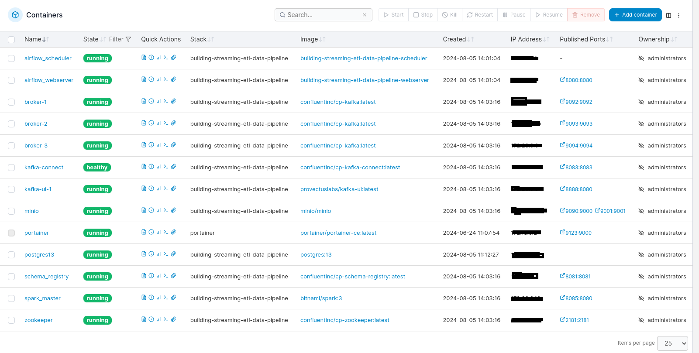
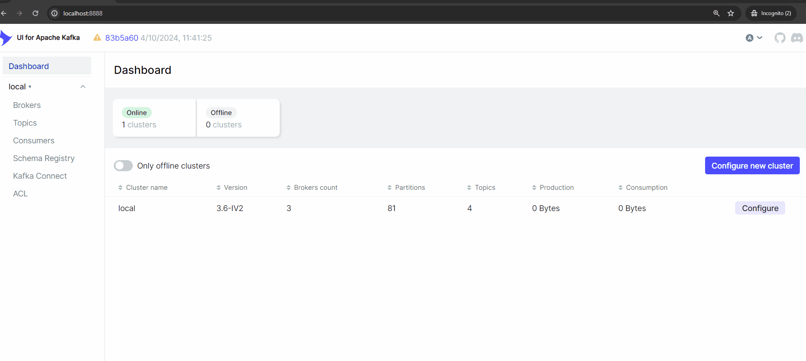
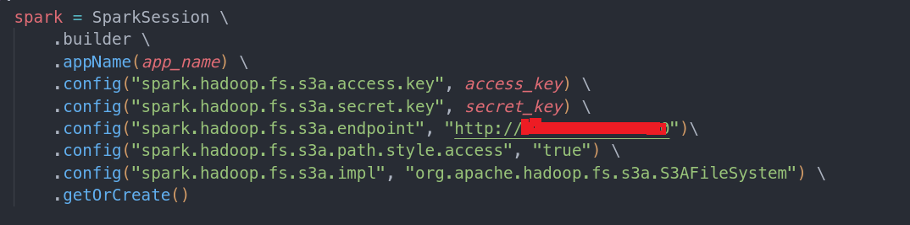
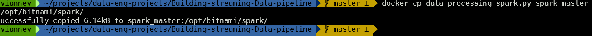
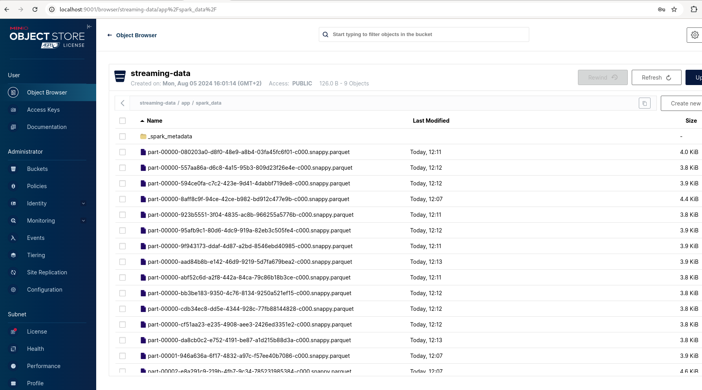

# Building-streaming-ETL-Data-pipeline


Building streaming Data pipeline using apache airflow,  kafka, spark and container based object storage ( Minio S3 Bucket)


## 1. Project overview and  architecture


In this project, we build a real-time ETL (Extract, Transform, and Load) data pipeline.  During this process we will use open api to get data Building a streaming ETL (Extract, Transform, Load) data pipeline involves ingesting real-time data , process and transform , and load it into a data storage or analytics system. This overview outlines the process of building such a pipeline requiring Apache Kafka for data ingestion, Apache Spark for data processing, and Amazon S3 for data storage. 

<br><br>
 

Our project is composed of several services:

### A. Apache kafka 

- ***Set up Kafka Cluster***: Deploy a Kafka cluster with multiple brokers for high availability and scalability.

- ***Create Kafka Topics*** : Define topics to categorize and organize the incoming data streams based on their sources or types.
- ***Configure Kafka Producers*** : integrate Kafka producers to send data from open api to the appropriate Kafka topic.


<br><br>
 

  
### B. Automation and Orchestration: apache airflow

Leverage automation and orchestration tools (e.g., Apache Airflow) to manage and coordinate the various components of the pipeline, enabling efficient deployment, scheduling, and maintenance.

<br><br>
 


### C. Data Processing with Apache Spark

Apache Spark is a powerful open-source distributed processing framework that excels at processing large-scale data streams. In this pipeline, Spark will consume data from Kafka topics, perform transformations and computations, and prepare the data for storage in Amazon S3.

- ***Configure Spark Streaming*** : Set up a Spark Streaming application to consume data from Kafka topic in real-time.
- ***Define Transformations*** : Implement the necessary transformations and computations on the incoming data streams using Spark's powerful APIs. This may include data cleaning, filtering, aggregations, and enrichment from other data sources.
- ***Integrate with Amazon S3*** : Configure Spark to write the processed data to Minio S3 object storage in a suitable format (e.g., Parquet, Avro, or CSV) for efficient storage and querying.

### D.  Data Storage in Minio S3
MinIO is a high-performance, S3 compatible object store. A MinIO "bucket" is equivalent to an S3 bucket, which is a fundamental container used to store objects (files) in object storage. In this pipeline, S3 will serve as the final destination for storing the processed data streams.

- ***Create S3 Bucket*** : Set up an Minio S3 bucket to store the processed data in real-time.
- ***Define Data Organization***: Determine the appropriate folder structure and naming conventions for organizing the data in the S3 bucket based on factors such as time, source, or data type.

- ***Configure Access and Permissions*** : Create  appropriate access key, secret key  and permissions for the Minio object storage  to ensure data security and compliance with organizational policies.


<br><br>


## 2. Getting Started

**Prerequisites**

 - Understanding of **Docker, docker compose** and **network**
 - **S3 bucket created**: We will use Mini object storage
 -  Basic understanding of Python and apache spark structured streaming
 -  Knowledge of how kafka works: topic, brokers, partitions and kafka streaming
- Basic undestanding of distributed systems


## 3. Setting up project environment:

-  Make sure docker is running: from terminal ``` docker --version```


- Clone the repository and navigate to the project directory


```
 git clone https://github.com/fermat01/Building-streaming-ETL-Data-pipeline.git
 ```
and 


```
 cd Building-streaming-ETL-Data-pipeline
 ```
We'll create dags and logs directories for apache airflow from terminal


```
mkdir dags/ logs/
```
and give them permission


```
chmod -R 777 dags/
chmod -R 777 logs/
```


**Create all services using docker compose**

```
docker compose up -d 

```


<br><br>

 


## 4. Access the services:

<ol>
<li>
Access airflow UI at <a href="http://localhost:8080 ">http://localhost:8080</a> using given credentials username: $\color{orange}{airflow01}$  and password: $\color{orange}{airflow01}$ 


<br><br>
 
<li/>
</l>
Access the Kafka UI at <a href="http://localhost:8888 ">http://localhost:8888</a> and  create topic name it $\color{orange}{streaming-topic}$  with number of partitions: $\color{orange}{6}$ 


<br><br>
 
</li>


<li>
 acess Minio  UI using <a href="http://127.0.0.1:9001">http://127.0.0.1:9001</a> and with  credentials uername: $\color{orange}{MINIOAIRFLOW01}$ and password:  $\color{orange}{ AIRFLOW123 }$ 
</li>


<br><br>
  

</ol> 

## 4. Spark application
Before submitting spark applcation, it is important to understant how spark communicate with apache kafka and Minio container based object storage when using docker. 
Make sure to verify the broker ports and hostnames.
Required jar files must be downloaded.
<ol>
  <li> Make sure Minio has a right API URL $\color{orange}{http://minio:9000}$ after to cummunicate with spark
  <br><br>
     
</li>
   <br><br>
  <li>
spark version can be verified using :<code>/opt/bitnami/spark/bin/spark-submit --version</code>
</li>
<li>and kafka version using the log of one of broker containers: <code>docker logs broker-1 | grep -i "kafka.*version" </code>

</li>

<li>
Copy your Spark script into the Docker container:

<code>docker cp data_processing_spark.py spark_master:/opt/bitnami/spark/</code>


<br><br>

  
</li>


<br><br>

 **Download required jar files**
 
<li> From scripts folder, copy the download_jars.sh to spark_master container using: </li>


 ``` docker cp download_jars.sh spark_master:/opt/bitnami/spark/  ```
 
    
    


then run this command from terminal to download all required jar files.


 ``` ./download_jars.sh ```

  **Submit your spark application**

From scripts folder, copy the run_spark_submit.sh to spark_master container using:


``` docker cp run_spark_submit.sh spark_master:/opt/bitnami/spark ```


 <li> Go inside spark container master node using </li>

```  docker exec -it spark_master /bin/bash ```


<li> then run this command to submit spark spark application from spark_master container terminal</li>


``` ./run_spark_submit.sh ```


<li>
Go back to minio bucket to ensure that data has been uploaded.</li>
And voilà, it worked !!!


<br><br>
  

</ol>


## 5. Conclusion

This project successfully demonstrates the construction of a real-time ETL (Extract, Transform, Load) data pipeline using Apache Kafka for data ingestion, Apache Spark for data processing, and Minio S3 bucket for data storage. By leveraging open APIs, we were able to ingest real-time data, process and transform it efficiently, and load it into a robust storage system for further analysis.
The use of Apache Kafka provided a scalable and fault-tolerant platform for data ingestion, ensuring that data streams were handled effectively. Apache Spark enabled real-time data processing and transformation, offering powerful capabilities for handling large datasets with low latency. Finally, Minio S3 object storage served as a reliable and scalable storage solution, allowing for seamless integration with various analytics tools.
Throughout this project, we highlighted the importance of selecting appropriate tools and technologies to meet the specific requirements of real-time data processing. The integration of these components resulted in a flexible, scalable, and efficient ETL pipeline capable of handling diverse data sources and formats.


