# Real-Time Streaming Data Platform

[](LICENSE)
[](https://github.com/fermat01/real-time-streaming-data-platform/actions/workflows/ci.yml)
[](https://github.com/fermat01/real-time-streaming-data-platform/actions/workflows/cd.yml)
[](https://www.python.org/)
[](https://airflow.apache.org/)
[](https://kafka.apache.org/)
[](https://spark.apache.org/)


A production-oriented **real-time streaming data platform** built with Apache Airflow, a three-broker Apache Kafka cluster, Confluent Schema Registry, Apache Spark Structured Streaming, MinIO, Prometheus, and Grafana.

The platform ingests live API events, validates them against governed Avro contracts, processes them on a distributed Spark cluster, separates valid and quarantined records, computes real-time analytics, persists Parquet datasets to S3-compatible object storage, and exposes operational metrics through a complete observability stack.

---

## Architecture

<p align="left">
  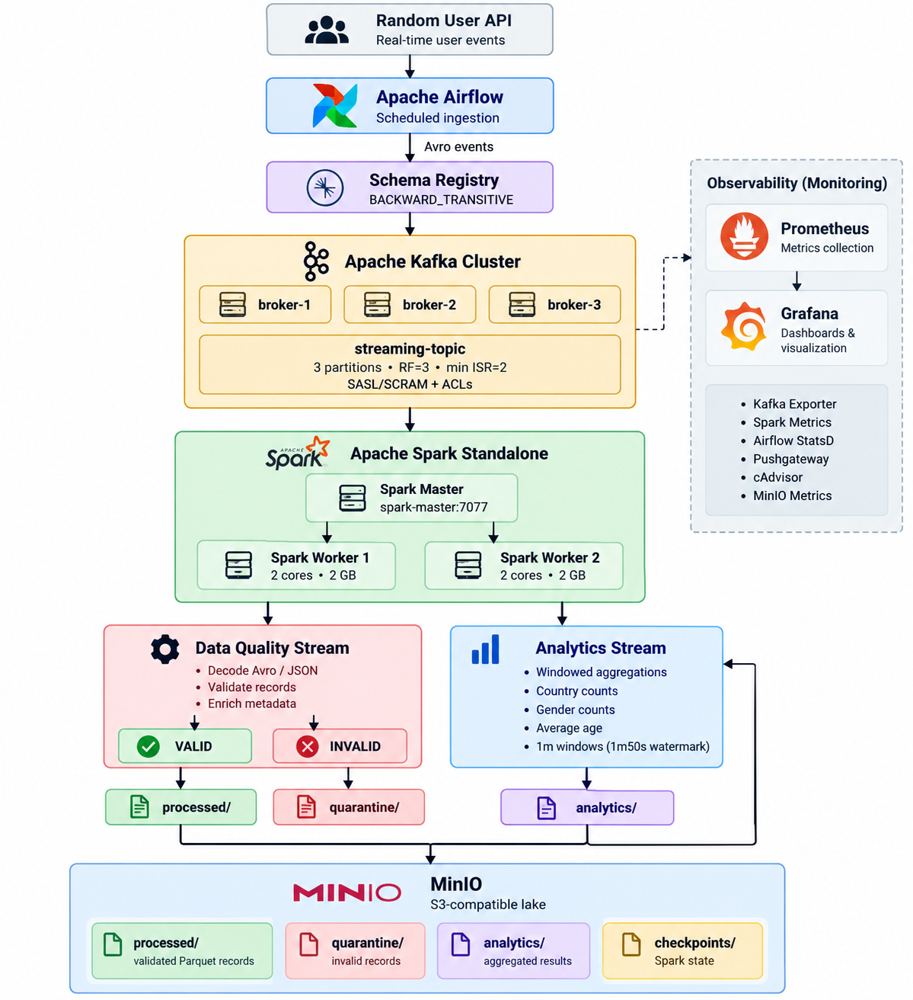
</p>

The complete platform runs locally through Docker Compose while preserving a distributed architecture: **three Kafka brokers and a Spark standalone cluster composed of one master and two workers**.

---

## Data Flow

The pipeline contains three main runtime stages.

### 1. Ingestion

<br><br>
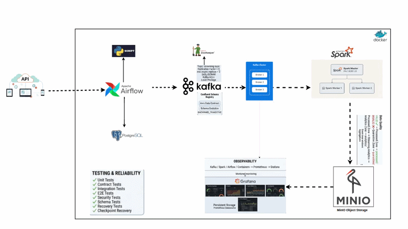

The Airflow DAG periodically retrieves user events from the Random User API and publishes them to Kafka.

The producer includes:

- API timeout handling
- Airflow task retries
- Kafka producer retries
- `acks=all`
- idempotent publishing
- Avro serialization
- Schema Registry integration

---

### 2. Data Quality Processing

<p align="left">
  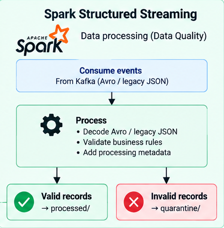
</p>

<br><br>
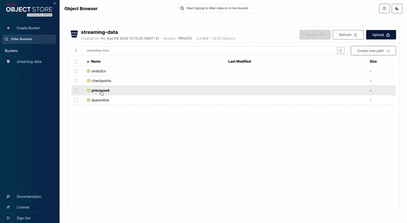

The primary Spark streaming application consumes Kafka events and applies schema decoding, validation, enrichment, and controlled error handling.

Valid records receive processing metadata including:

```text
processing_timestamp
ingestion_date
```

and are stored as Parquet under:

```text
s3a://streaming-data/processed/
```

Invalid or malformed events are preserved rather than silently discarded:

```text
s3a://streaming-data/quarantine/
```

Quarantined records retain diagnostic information and the original payload when possible.

---

### 3. Real-Time Analytics

A separate Spark Structured Streaming application consumes the validated Parquet stream:

<p align="left">
  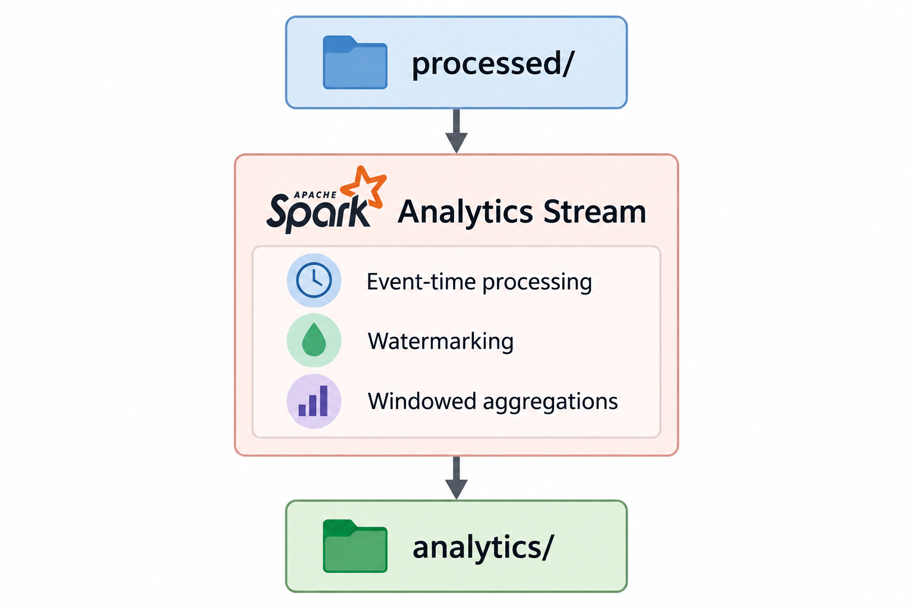
</p>

The analytics job currently computes:

- event counts by country
- event counts by gender
- average age
- one-minute event windows

A **1 minute 50 second watermark** allows late-arriving events to be incorporated before window results are finalized.

Analytics output is written as Parquet to:

```text
s3a://streaming-data/analytics/
```

---

## Apache Spark Cluster

Spark runs in **standalone distributed mode**, not local mode.

<p align="left">
  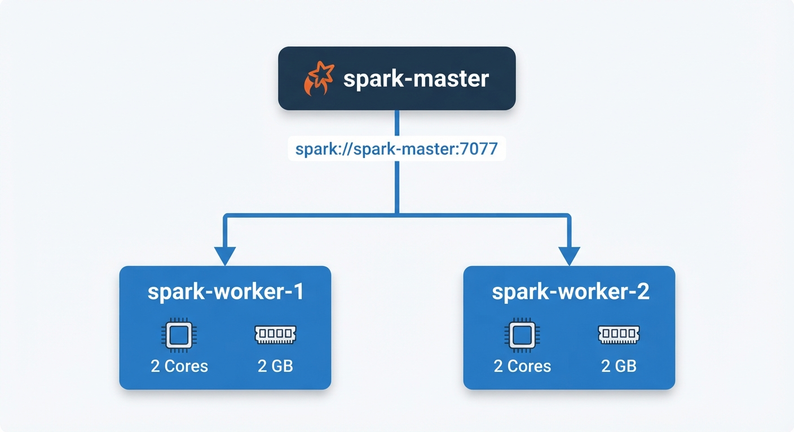
</p>

Both streaming applications are submitted to the Spark master, which distributes execution across the two workers.

The Spark runtime uses:

- Apache Spark 3.5.8
- Spark Structured Streaming
- Python 3.11
- `uv`-managed Python environment
- Kafka Structured Streaming integration
- Hadoop S3A
- MinIO
- Parquet
- checkpointing
- Prometheus metrics

---

## Apache Kafka Cluster

The platform runs a **three-broker Kafka cluster**:


<p align="left">
  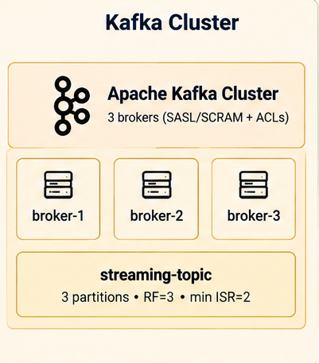
</p>


The primary streaming topic is configured with:

```text
Partitions          3
Replication factor  3
min.insync.replicas 2
```

This provides a realistic distributed event-streaming topology for local development.

Kafka also integrates with:

- ZooKeeper
- Confluent Schema Registry
- Kafka Connect
- Kafka UI
- Kafka Exporter
- SASL/SCRAM authentication
- Kafka ACL authorization

---

## Schema Governance

New events are serialized using **Apache Avro** and governed through Confluent Schema Registry.

The canonical schema is:

```text
schemas/user_event.avsc
```

The topic-value subject is:

```text
streaming-topic-value
```

Compatibility is configured as:

```text
BACKWARD_TRANSITIVE
```

The event flow is:

<p align="left">
  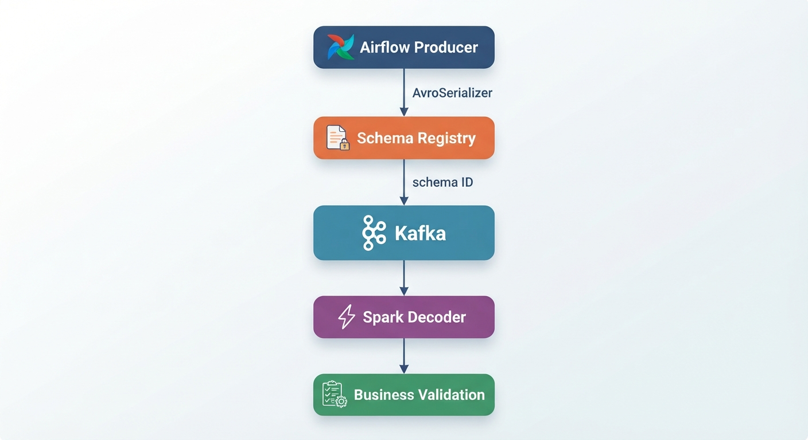
</p>

Schema validation and business data-quality validation remain deliberately separate.

Avro protects the structural contract, while Spark validates domain rules such as empty fields, invalid ages, and invalid coordinates.

The consumer also retains a legacy JSON fallback so historical messages already present in the topic remain readable.

---

## MinIO Data Lake

MinIO provides local **S3-compatible object storage**.

The bucket is organized into four main logical areas:


<p align="left">
  
</p>


This separates operational processing concerns and allows each streaming workload to maintain independent checkpoints.

---

## Observability

The platform includes a dedicated observability layer:


<p align="left">
  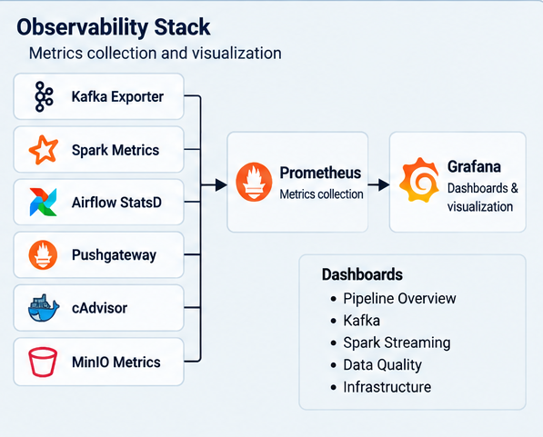
</p>


### Prometheus

Prometheus collects metrics from:

- Kafka Exporter
- Airflow StatsD Exporter
- Spark Prometheus endpoints
- Spark streaming listeners
- Pushgateway
- cAdvisor
- MinIO

Prometheus retains local metrics data using persistent Docker storage.

### Grafana

Grafana is automatically provisioned with Prometheus as its datasource.

Five focused dashboards are included:

1. **Pipeline Overview**
2. **Kafka**
3. **Spark Streaming**
4. **Data Quality**
5. **Infrastructure**

### Application Metrics

The Spark streaming applications expose metrics including:

- streaming query progress
- query failures
- valid records
- quarantined records

Metrics publishing is best-effort: monitoring failures do not cause the data pipeline itself to fail.

### Development Alerts

Prometheus alert rules cover conditions including:

- Kafka under-replication
- unavailable monitoring targets
- Spark streaming failures
- Airflow task failures
- excessive Kafka consumer lag
- high container memory usage

The included thresholds are designed for development/demo workloads and should be recalibrated for production.

---

## Security

Kafka uses:

```text
SASL/SCRAM-SHA-256
```

Anonymous Kafka access is disabled.

Separate service identities are used for:

```text
Airflow producer
Spark consumer
Kafka Connect
Schema Registry
Kafka UI
Kafka monitoring
Kafka administration
```

Kafka ACLs follow least privilege.

For example:

<p align="left">
 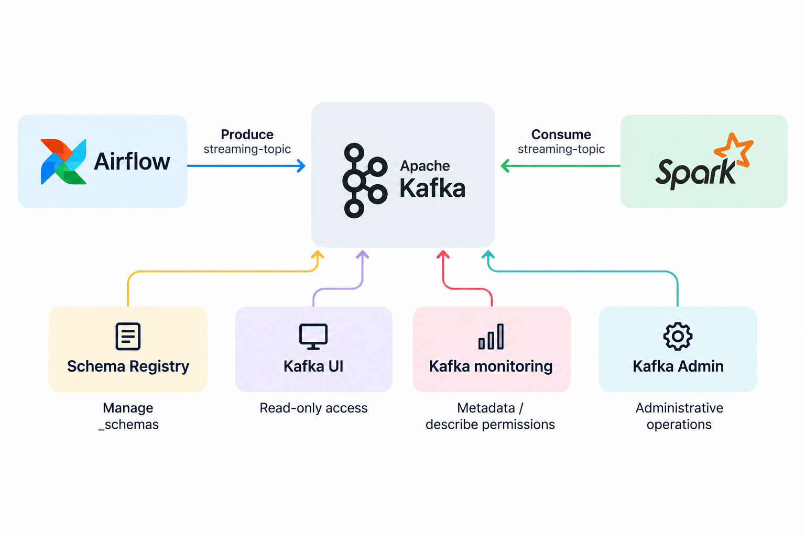
</p>

Secrets are externalized through `.env`.

Only the safe template is version controlled:

```text
.env.example
```

> The project implements a security-hardened local architecture, not a complete production security boundary. Kafka currently uses `SASL_PLAINTEXT`; a production deployment should additionally use TLS and an external secrets manager.

---

## Technology Stack

| Layer              | Technologies                                           |
| ------------------ | ------------------------------------------------------ |
| Data Source        | Random User API                                        |
| Orchestration      | Apache Airflow 2                                       |
| Event Streaming    | Apache Kafka — 3 brokers                               |
| Schema Governance  | Confluent Schema Registry, Avro                        |
| Kafka Ecosystem    | Kafka Connect, Kafka UI                                |
| Stream Processing  | Apache Spark 3.5.8 Structured Streaming                |
| Compute            | Spark Standalone — 1 master + 2 workers                |
| Storage            | MinIO / Hadoop S3A                                     |
| Data Format        | Avro, Parquet                                          |
| Observability      | Prometheus, Grafana                                    |
| Metrics            | Kafka Exporter, StatsD Exporter, Pushgateway, cAdvisor |
| Runtime            | Python 3.11                                            |
| Python Tooling     | uv                                                     |
| Code Quality       | Ruff, pytest                                           |
| Infrastructure     | Docker, Docker Compose                                 |
| CI/CD              | GitHub Actions                                         |
| Container Registry | GitHub Container Registry                              |

---

## Repository Structure

```text
.
├── .github/
│   └── workflows/
│       ├── ci.yml
│       └── cd.yml
│
├── dags/                       # Airflow ingestion DAG
├── images/                     # README screenshots and demos
│
├── monitoring/
│   ├── grafana/                # Provisioning + dashboards
│   ├── prometheus/             # Prometheus config + alerts
│   ├── spark/                  # Spark metrics configuration
│   └── hadoop/                 # Hadoop/S3A metrics configuration
│
├── schemas/
│   └── user_event.avsc         # Canonical Avro event contract
│
├── scripts/
│   ├── init-kafka.sh
│   ├── run_spark_submit.sh
│   └── run_spark_analytics.sh
│
├── spark_app/                  # Processing + analytics applications
├── tests/
│
├── .env.example
├── .python-version
├── Dockerfile                  # Airflow runtime
├── Dockerfile.spark            # Spark runtime
├── docker-compose.yml
├── pyproject.toml
├── uv.lock
└── README.md
```

---

## Getting Started

### Prerequisites

You need:

- Docker
- Docker Compose
- Git
- `uv` for local Python development and testing

---

### 1. Clone the Repository

```bash
git clone https://github.com/fermat01/Building-streaming-ETL-Data-pipeline.git
cd Building-streaming-ETL-Data-pipeline
```

### 2. Configure Environment Variables

Create your local environment:

```bash
cp .env.example .env
```

Replace all:

```text
<CHANGE_ME>
```

values with local development credentials.

Never commit `.env`.

### 3. Start the Platform

```bash
docker compose up -d
```

Check the containers:

```bash
docker compose ps
```

### 4. Start the Data-Quality Stream

```bash
./scripts/run_spark_submit.sh
```

### 5. Start the Analytics Stream

Open another terminal:

```bash
./scripts/run_spark_analytics.sh
```

Both jobs are submitted to:

```text
spark://spark-master:7077
```

and execute on the standalone Spark cluster.

---

## Service Interfaces

| Service         | Local endpoint          |
| --------------- | ----------------------- |
| Airflow         | `http://localhost:8080` |
| Schema Registry | `http://localhost:8081` |
| Kafka UI        | `http://localhost:8888` |
| Spark Master UI | `http://localhost:8085` |
| MinIO API       | `http://localhost:9090` |
| MinIO Console   | `http://localhost:9001` |
| Prometheus      | `http://localhost:9091` |
| Grafana         | `http://localhost:3000` |

Credentials are configured through `.env`.

---

## Verify the Pipeline

### Check Containers

```bash
docker compose ps
```

### Check Spark Cluster

```bash
curl http://localhost:8085/json/
```

The Spark master should report both registered workers.

### Check Spark Logs

```bash
docker logs spark-master --tail 100
```

### Inspect Kafka

Open Kafka UI:

```text
http://localhost:8888
```

and inspect `streaming-topic`.

### Inspect MinIO

Open:

```text
http://localhost:9001
```

and verify the `streaming-data` bucket.

After the pipeline has processed events, data should appear under:

```text
processed/
quarantine/
analytics/
checkpoints/
```

---

## Development

The project uses **`uv`**, rather than pip-based project dependency management.

Install Python 3.11:

```bash
uv python install 3.11
```

Synchronize the environment:

```bash
uv sync --locked --all-extras --dev
```

---

## Testing and Quality Gates

Run tests:

```bash
uv run pytest -q
```

Run Ruff:

```bash
uv run ruff check .
```

Verify formatting:

```bash
uv run ruff format --check .
```

Compile Python sources:

```bash
uv run python -m compileall -q dags spark_app tests
```

Validate shell scripts:

```bash
bash -n scripts/*.sh
```

Validate Docker Compose:

```bash
docker compose config --quiet
```

The complete local quality gate is:

```bash
uv run ruff check .
uv run ruff format --check .
uv run pytest -q
uv run python -m compileall -q dags spark_app tests
bash -n scripts/*.sh
docker compose config --quiet
```

---

## CI/CD

### Continuous Integration

GitHub Actions automatically validates changes on pushes and pull requests.

CI runs:

```text
Ruff linting
Ruff formatting
pytest
Python compilation
Shell syntax validation
Docker Compose validation
```

The same checks can be executed locally before opening a pull request.

### Continuous Delivery

Version tags trigger the container delivery workflow.

For example:

```bash
git tag v1.0.0
git push origin v1.0.0
```

GitHub Actions then builds:


<p align="left">
  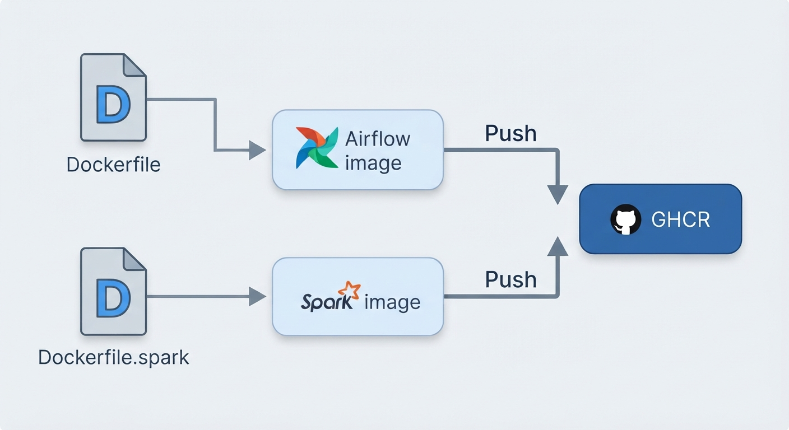
</p>


The images are published to GitHub Container Registry using the version tag.

The workflow implements **Continuous Delivery**, not automatic production deployment. A production deployment would require a target environment such as Kubernetes, ECS, or another container platform.

---

## Engineering Decisions

### Why Three Kafka Brokers?

A multi-broker cluster demonstrates replication, partition distribution, availability behavior, authenticated inter-service communication, and ACL-based authorization more realistically than a single-node Kafka deployment.

### Why a Spark Master and Two Workers?

The standalone cluster ensures the streaming applications execute in a genuinely distributed Spark topology rather than using `local[*]`.

### Why Separate Data Quality and Analytics Streams?

The first workload owns ingestion validation and data-quality routing. The second operates only on validated records.

This separation prevents analytical logic from being coupled directly to Kafka ingestion and creates a reusable curated data layer.

### Why a Quarantine Layer?

Invalid events should remain observable and diagnosable rather than being silently dropped or terminating the streaming pipeline.

### Why Avro and Schema Registry?

They provide explicit event contracts, schema IDs, centralized governance, compatibility validation, and safer schema evolution.

### Why MinIO?

MinIO provides an S3-compatible object-storage interface locally, allowing the architecture to use data-lake patterns without requiring a cloud account.

### Why Separate Observability?

Prometheus and Grafana monitor the platform without becoming hard runtime dependencies of the data pipeline. Monitoring can therefore be restarted independently without stopping ingestion or processing.

---

## Production Considerations

This repository demonstrates **production-oriented engineering patterns in a local Docker Compose environment**.

For an actual production deployment, additional work would include:

- TLS for Kafka and service-to-service traffic
- external secret management
- cloud object storage such as Amazon S3
- Kubernetes/ECS or another orchestration platform
- infrastructure as code
- multi-node infrastructure across failure domains
- centralized application logging
- automated vulnerability scanning
- disaster recovery procedures
- load/performance testing
- automated end-to-end integration testing

---

## What This Project Demonstrates

This project demonstrates practical Data Engineering skills across the full streaming lifecycle:


<p align="left">
  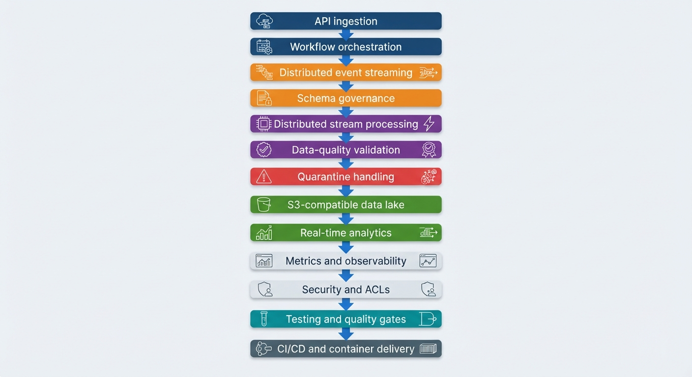
</p>


Core competencies demonstrated include **Apache Kafka, Apache Spark Structured Streaming, Apache Airflow, distributed systems, Avro/schema governance, data-quality engineering, streaming analytics, object storage, observability, Docker, modern Python tooling, automated testing, and CI/CD**.

---

## License

Licensed under the **Apache License 2.0**.
