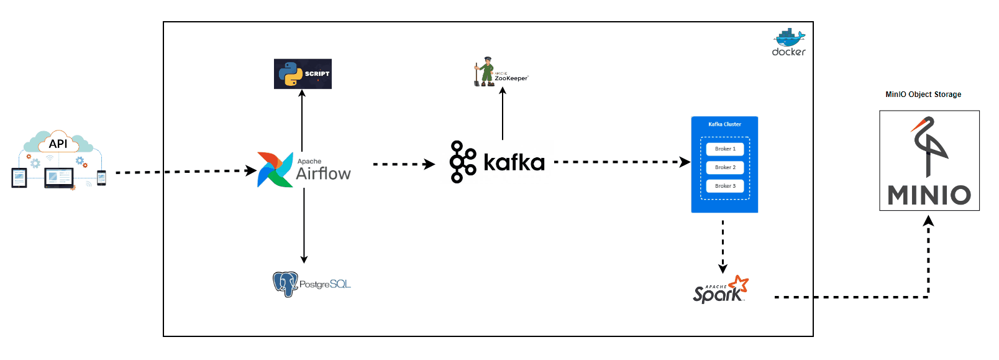
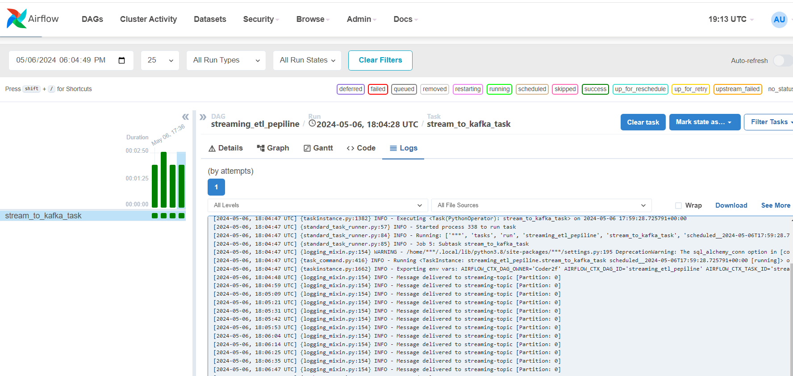
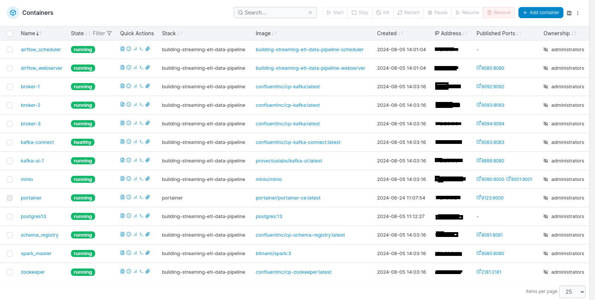
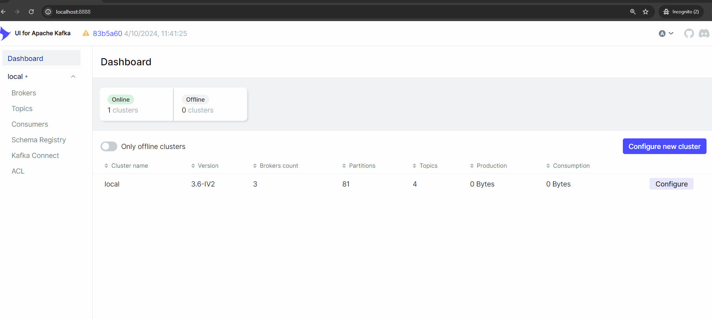
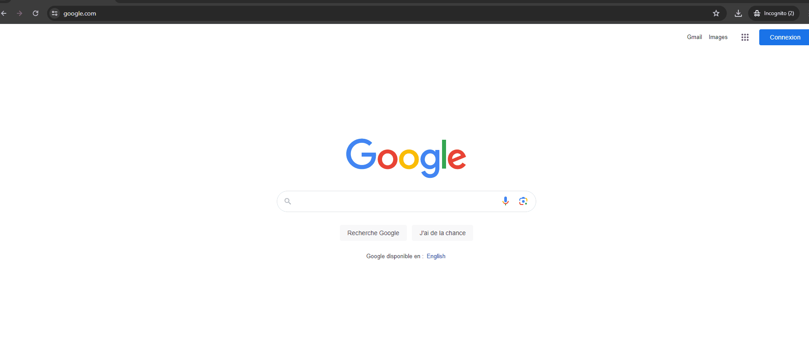

# Building-streaming-ETL-Data-pipeline


Building streaming Data pipeline using apache airflow, kafka, spark and container based object storage ( Minio S3 Bucket)

## 1. Project overview and architecture

In this project, we build a real-time ETL (Extract, Transform, and Load) data pipeline. During this process we will use open api to get data Building a streaming ETL (Extract, Transform, Load) data pipeline involves ingesting real-time data , process and transform , and load it into a data storage or analytics system. This overview outlines the process of building such a pipeline requiring Apache Kafka for data ingestion, Apache Spark for data processing, and Amazon S3 for data storage.

<br><br>


Our project is composed of several services:

### a. Apache kafka

- **_Set up Kafka Cluster_**: Deploy a Kafka cluster with multiple brokers for high availability and scalability.

- **_Create Kafka Topics_** : Define topics to categorize and organize the incoming data streams based on their sources or types.
- **_Configure Kafka Producers_** : integrate Kafka producers to send data from open api to the appropriate Kafka topic.

<br><br>


### b. Automation and Orchestration: apache airflow

Leverage automation and orchestration tools (e.g., Apache Airflow) to manage and coordinate the various components of the pipeline, enabling efficient deployment, scheduling, and maintenance.

<br><br>


### c. Data Processing with Apache Spark

Apache Spark is a powerful open-source distributed processing framework that excels at processing large-scale data streams. In this pipeline, Spark will consume data from Kafka topics, perform transformations and computations, and prepare the data for storage in Amazon S3.

- **_Configure Spark Streaming_** : Set up a Spark Streaming application to consume data from Kafka topic in real-time.
- **_Define Transformations_** : Implement the necessary transformations and computations on the incoming data streams using Spark's powerful APIs. This may include data cleaning, filtering, aggregations, and enrichment from other data sources.
- **_Integrate with Amazon S3_** : Configure Spark to write the processed data to Minio S3 object storage in a suitable format (e.g., Parquet, Avro, or CSV) for efficient storage and querying.

### d. Data Storage in Minio S3

Minio is a high-performance, S3 compatible object store. A MinIO "bucket" is equivalent to an S3 bucket, which is a fundamental container used to store objects (files) in object storage. In this pipeline, S3 will serve as the final destination for storing the processed data streams.

- **_Create S3 Bucket_** : Set up an Minio S3 bucket to store the processed data in real-time.
- **_Define Data Organization_**: Determine the appropriate folder structure and naming conventions for organizing the data in the S3 bucket based on factors such as time, source, or data type.

- **_Configure Access and Permissions_** : Create appropriate access key, secret key and permissions for the Minio object storage to ensure data security and compliance with organizational policies.

<br><br>

## 2. Getting Started

**Prerequisites**

- Understanding of **Docker, docker compose** and **network**
- **S3 bucket created**: We will use Minio object storage
- Basic understanding of Python and apache spark structured streaming
- Knowledge of how kafka works: topic, brokers, partitions and kafka streaming
- Basic undestanding of distributed systems

## 3. Setting up project environment:

- Make sure docker is running: from terminal ` docker --version`

- Clone the repository and navigate to the project directory

```
 git clone https://github.com/fermat01/Building-streaming-ETL-Data-pipeline.git
```

and

```
 cd Building-streaming-ETL-Data-pipeline
```

**Create all services using docker compose**

```
docker compose up -d

```

To stop and start the existing containers:

```
docker compose stop
docker compose start
```

Use `docker compose up -d` instead of `start` after `docker compose down`, or
when the containers have not been created yet. To start only the Spark cluster
and create it if necessary, run:

```
docker compose up -d spark-master spark-worker-1 spark-worker-2
```

<br><br>



## 4. Access the services:

<ol>
<li>
Access airflow UI at <a href="http://localhost:8080 ">http://localhost:8080</a> using given credentials username: $\color{orange}{airflow01}$  and password: $\color{orange}{airflow01}$

<br><br>


<li/>
</l>
Access the Kafka UI at <a href="http://localhost:8888 ">http://localhost:8888</a> and  create topic name it $\color{orange}{streaming-topic}$  with number of partitions: $\color{orange}{6}$

<br><br>


</li>

<li>
 Acess Minio  UI using <a href="http://127.0.0.1:9001">http://127.0.0.1:9001</a> and with  credentials username: $\color{orange}{MINIOAIRFLOW01}$ and password:  $\color{orange}{ AIRFLOW123 }$ 
</li>

<br><br>


</ol>

## 5. Streaming operations

The pipeline now has three operations while preserving Airflow 2, the three Kafka brokers, Spark 3.5.8 standalone mode (one master and two workers), and MinIO:

```text
Random User API -> Airflow 2 -> Kafka streaming-topic
                              -> Spark data quality -> processed/ (Parquet)
                                                   -> quarantine/ (Parquet)
                              -> Spark analytics -> analytics/ (Parquet)
```

### Start the services

```bash
docker compose up -d

# Terminal 1
./scripts/run_spark_submit.sh

# Terminal 2
./scripts/run_spark_analytics.sh
```

Check the service status with `docker compose ps`. The Airflow DAG `streaming_etl_pepiline` runs every five minutes. Each task run fetches users from the Random User API with a timeout, retries at the Airflow task level, and publishes events using `acks=all`, idempotence, and retries. Both Spark commands submit to `spark://spark-master:7077`; neither uses local mode.

### Submit the Spark jobs

Start the data-quality stream first, then run the analytics stream in another terminal using the commands above.

The processing job parses the explicit event schema, adds `processing_timestamp` and `ingestion_date`, writes valid records to `s3a://streaming-data/processed/`, and writes malformed or invalid records with a reason and raw payload to `s3a://streaming-data/quarantine/`. Both sinks use independent checkpoints under `s3a://streaming-data/checkpoints/`.

The analytics job reads validated Parquet as a streaming source and writes one-minute country/gender event counts and average ages to `s3a://streaming-data/analytics/`, also with checkpointing. It uses a 1 minute 50 second watermark, so results are normally delayed by roughly two minutes to allow late records to arrive.

### Verify the pipeline

```bash
# Inspect Kafka events from inside broker 1
docker exec -it broker-1 kafka-console-consumer \
  --bootstrap-server broker-1:9092 --topic streaming-topic \
  --from-beginning --max-messages 3

# Inspect Spark applications and worker registration
curl http://localhost:8085/json/
docker logs spark-master --tail 100

# Inspect MinIO-backed output paths from the MinIO client, if installed
mc alias set local http://localhost:9090 "$MINIO_ROOT_USER" "$MINIO_ROOT_PASSWORD"
mc find local/streaming-data --name '*.parquet'
```

The MinIO console is available at http://localhost:9001. The local contract tests can be run without starting the stack:

```bash
python -m unittest discover -s tests -v
```

### CI/CD

The project includes runtime unit tests in
[test_streaming_data.py](tests/test_streaming_data.py), the CI workflow in
[ci.yml](.github/workflows/ci.yml), and the CD workflow in
[cd.yml](.github/workflows/cd.yml).

CI runs automatically on every push and pull request. It runs:

- Unit and contract tests
- Python compilation
- Shell syntax validation
- Docker Compose validation

CD runs when you push a version tag such as `v1.0.0`:

```bash
git tag v1.0.0
git push origin v1.0.0
```

The CD workflow builds and publishes the Airflow and Spark images to GitHub
Container Registry. The local Compose stack remains the deployment target for
development; production deployment requires a configured server or
orchestration platform to pull those images.

## 6. Conclusion

This project successfully demonstrates the construction of a real-time ETL (Extract, Transform, Load) data pipeline using Apache Kafka for data ingestion, Apache Spark for data processing, and Minio S3 bucket for data storage. By leveraging open APIs, we were able to ingest real-time data, process and transform it efficiently, and load it into a robust storage system for further analysis.
The use of Apache Kafka provided a scalable and fault-tolerant platform for data ingestion, ensuring that data streams were handled effectively. Apache Spark enabled real-time data processing and transformation, offering powerful capabilities for handling large datasets with low latency. Finally, Minio S3 object storage served as a reliable and scalable storage solution, allowing for seamless integration with various analytics tools.
Throughout this project, we highlighted the importance of selecting appropriate tools and technologies to meet the specific requirements of real-time data processing. The integration of these components resulted in a flexible, scalable, and efficient ETL pipeline capable of handling diverse data sources and formats.
